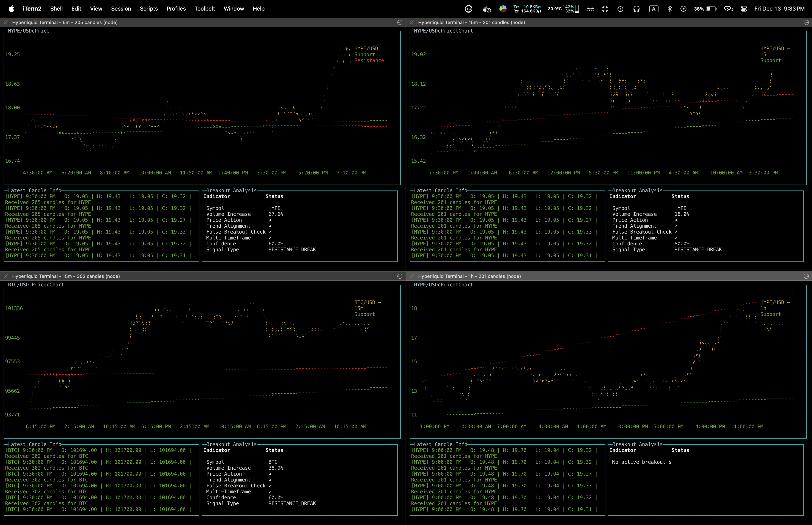

# Hyperliquid Terminal

A terminal-based trading interface for Hyperliquid with real-time charts and breakout detection.

## Features

- Real-time price charts with support and resistance lines
- Breakout detection with confidence scoring
- Multi-timeframe analysis
- Customizable candle intervals
- Adjustable chart history
- Live trade and market data

## Prerequisites

- Node.js (v14 or higher)
- npm (Node Package Manager)

## Installation

1. Clone the repository:
```bash
git clone [your-repo-url]
cd [repo-name]
```

2. Install dependencies:
```bash
npm install
```

3. Build the project:
```bash
npm run build
```

## Usage

Start the application:
```bash
npm start
```

You will be prompted to:
1. Enter a trading symbol (e.g., BTC)
2. Select a candle interval (e.g., 5m, 15m, 1h)
3. Set maximum number of candles to display (default: 200)

### Controls

- `q`, `Esc`, or `Ctrl+C` to exit
- Use mouse or touchpad to interact with the charts

### Multiple Charts

You can run multiple instances of the terminal simultaneously, each tracking a different symbol or timeframe:

1. Open multiple terminal windows
2. Run `npm start` in each window
3. Enter different symbols/intervals for each instance

This allows you to monitor multiple markets or timeframes side by side on your screen.

### Display Sections

The terminal interface is divided into several sections:
- Main Chart: Displays price action with support/resistance lines
- Log Box: Shows latest candle information
- Breakout Analysis: Displays current breakout signals and analysis

## Development

Build the project:
```bash
npm run build
```

Run in development mode:
```bash
npm run dev
```

## Screenshot



## License

This project is licensed under the MIT License - see the [LICENSE](LICENSE) file for details.
